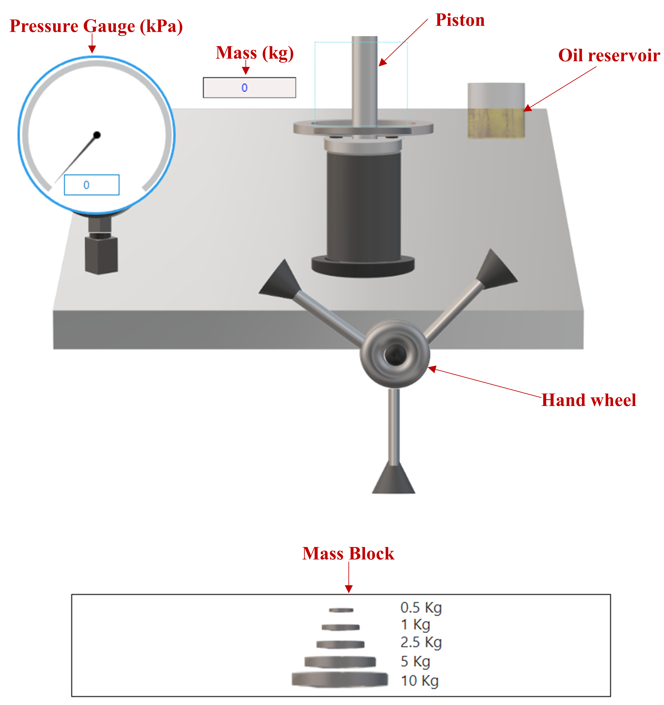

## Procedure

**Steps to perform the simuation**

This experiment consists of two main parts: Loading and Unloading. You will calibrate a pressure gauge using a dead weight tester filled with oil. The piston's weight and its cross-sectional area are fixed and known. The gauge can measure pressures from 0 to 1000 kPa. Fig. 1 illustrates the setup for pressure gauge calibration using a dead-weight tester simulation interface. To follow the instructions on the simulation page, please click on the blue ‘Instructions’ tab.

**Part 1: Loading**
<ol>

<li> Begin by dragging a 0.5 kg mass from the set of Mass Blocks and placing it onto the blue box above the piston. The selected mass will appear in the “Mass (kg)” input field.</li>

<li> When the mass is placed, the piston will move downward due to the applied pressure.</li>

<li> Click the hand wheel to rotate it clockwise. This action increases the oil pressure inside the chamber. The pressure gauge will display the increasing pressure as the wheel turns.</li>

<li> Continue turning until the pressure shown on the gauge equals the pressure caused by the weight. The piston will return to its original position when this balance is reached.</li>

<li> Click “Table” at the bottom of the page to view the observation table. Then, press “Add to Table” to record your reading.</li>

<li> Repeat these steps by adding each subsequent mass (1 kg, 2.5 kg, 5 kg, 10 kg) one at a time, always making sure the total mass is shown in the input field and the piston is brought back up after each adjustment.</li>

<li> After recording three or four sets of data, click “Plot” to generate a graph of Percentage Error (%) versus Gauge Reading (kPa). To save the plot, hover your mouse over the plot area and click on the camera icon that appears in the top right corner.</li>

<li> Use the “Clear” button to erase your data and graph if you need to restart. You can also hide the table by clicking “Table” again.</li>

</ol>

  

<b>Fig. 1. Setup for pressure gauge calibration using a dead weight tester simulation interface</b>

<b>Part 2: Unloading</b>
<ol>
<li> After completing the loading phase, start removing weights. Drag the topmost mass from the blue box on the piston back to the Mass Block. The updated mass will display in the “Mass (kg)” input field.</li>

<li> As you remove each mass, the piston will rise due to the decreasing pressure.</li>

<li> Rotate the wheel anti-clockwise to gradually reduce the oil pressure. Stop when the gauge pressure once again matches the pressure due to the remaining mass; the piston should just return to its previous position.</li>

<li> As before, open the observation table with “Table” and record your reading by clicking “Add to Table.”</li>

<li> Continue removing masses one at a time, repeating the steps above for each change.</li>

<li> After three or four observations, click “Plot” to visualize your unloading data. Download the plot using the camera icon if needed.</li>

<li> Use “Clear” to remove your unloading data and plot, and click "Table" to hide the table.</li>

Follow these steps for both loading and unloading to fully calibrate your gauge and to gather a complete set of calibration data for analysis.
</ol>

