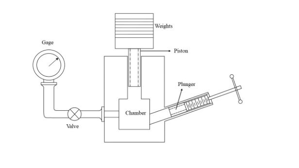

# Theory

 Pressure gauges are standard devices for accurate and precise measurement of pressure. Pressure gauge calibration is important to ensure the accuracy of the measurement. A dead-weight tester is a device that balances fluid pressure with a known weight. Typically, it is used for static calibration of pressure gages. Gauge pressure is positive for pressures above atmospheric pressure and negative for pressures below it. All pressure gauges, of whatever type, need to be calibrated. As the calibration may change over time, the standard calibration procedure is to load the gauge with known weights using a dead-weight tester. The experiment, however, works satisfactorily with oil.

This device has three main components: a fluid (oil) that transmits the pressure, a weight and piston used to apply the pressure, and a connection port for the gauge to be calibrated. The dead-weight tester also contains an oil reservoir and an adjusting piston or screw pump. During calibration tests, the reservoir accumulates oil displaced by the vertical piston when an extensive range of accurately calibrated weights is used for a given gauge. The adjusting piston is used to ensure the vertical piston is freely floating on the oil. 

To carry out tests or calibrate a pressure gauge with the dead weight tester, accurately calibrated weight masses (Force) are loaded on the piston (Area), which rises freely within its cylinder. These weights balance the upward force created by the pressure within the system:

$$Pressure = \frac{F}{A}$$ 
$$F = M g$$

where,

F= force applied to the liquid in the calibrator cylinder in Newton (N);

M= Total mass including the mass of the piston in kilograms (kg);

A= cross-sectional area of the piston in square meter (m2);

g= Acceleration due to gravity in meter per second square (m/s2).

So for each weight added, the pressure transmitted within the oil in the dead weight tester is calculated with the above formula because the area of the piston of the tester is accurately known.

A known (calibration) pressure will be produced in this experiment by applying weights of known magnitude to a piston of known cross-sectional area. During the process of calibration, the liquid from the reservoir is used to prime the system, and the adjusting piston is used to bring the pressure of the system up to the desired level. As a result of the displacement of liquid, the piston moves upwards within the cylinder to counteract the downward force exerted by the weights. This is because liquids are relatively incompressible. This pressure can be altered by either adding weights to the piston or experimenting with various combinations of pistons and cylinders that have varying surface areas. By rotating the piston-weight assembly during the measurement, the axial viscous friction between the piston and the cylinder may be significantly reduced. As the pressure rises, it is possible that the plunger will need to be moved forward in order to compensate for the compression of the oil as well as any gas that has become trapped in the apertures.

Below is a diagram depicting how to set up a dead weight tester for calibrating a pressure gauge on a level, stable workbench or similar surface.

				

Fig.1:- Dead weight Tester

The gravity error due to elevation, z (in meters), and latitude j (in degrees) can be corrected by the dimensionless correction factor as:

$$e_{gravity} = - ( 2.637 \times 10^{-3} \ cos (2 \phi) + 2.9 \times 10^{-8} \ z + 5 \times 10^{-5} )$$

and the air buoyancy error, ebuoyancy, by

$$e_{bouyancy} = - \frac{\rho_{air}}{\rho_{masses}}$$

Then the indicated pressure of the gauge, &rho;i , can be corrected as:

$$\rho = \rho_i (1 + e_{gravity} + e_{buoyancy})$$

The accuracy of the dead-weight tester is compromised by a number of factors, including the following: 

(1) friction between the cylinder and the piston.

(2) uncertainty in the area of the piston.

(3) error caused by buoyancy.

(4) error caused by gravity.
				

						
								