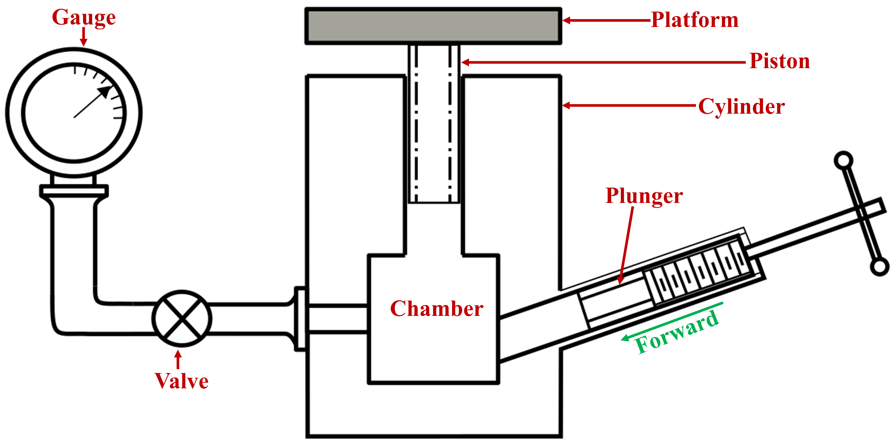
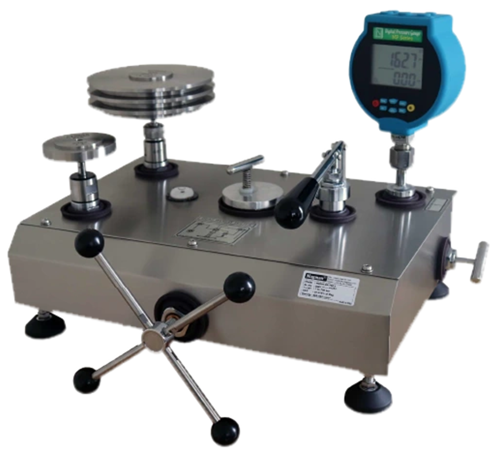

## Theory

 Pressure gauges are essential instruments for measuring fluid pressure accurately in industrial, scientific, and engineering applications. However, their readings can drift over time due to mechanical wear, environmental factors, or material fatigue, which can potentially lead to unsafe or unreliable outcomes. To maintain precision, gauges must be periodically calibrated against a primary standard of measurement. One of the most common methods for calibrating a pressure gauge is the use of a dead-weight tester. This instrument generates a known pressure by applying accurately calibrated weights to a piston of known cross-sectional area. The pressure is transmitted through an incompressible fluid (usually oil), ensuring that the force applied is entirely converted into fluid pressure. The dead-weight tester operates on the fundamental hydrostatic principle that a known force applied over a precise area generates a predictable pressure. Weights of calibrated masses are stacked on a free-floating piston immersed in a cylinder filled with oil. The downward gravitational force from these weights balances the upward hydrostatic force from the pressurized oil, achieving equilibrium when:

$$Pressure = \frac{F}{A} \tag{1}$$ 

$$F = M g \tag{2}$$

where,

F = force applied to the liquid in the calibrator cylinder in Newton (N);

M = Total mass including the mass of the piston in kilograms (kg);

A = cross-sectional area of the piston in square meter (m2);

g = Acceleration due to gravity in meter per second square (m/s2).

Therefore, for each weight added, the pressure transmitted within the oil in the dead weight tester is calculated using the above formula, as the area of the piston in the tester is accurately known. Thus, by knowing M and A, the applied pressure can be precisely calculated. A typical dead-weight tester consists of an oil reservoir, a piston-cylinder assembly, a set of calibrated weights, a plunger, and a gauge connection port. The oil reservoir contains the working fluid, usually oil, which transmits pressure throughout the system. The piston-cylinder assembly converts the applied mass into fluid pressure, while the calibrated weights generate known forces when placed on the piston. The punger is used to fine-tune and stabilize the pressure within the system, ensuring precise calibration conditions. The gauge connection port provides an interface for attaching the pressure gauge that needs to be calibrated. The entire system is filled with clean oil, and the piston is carefully adjusted to float freely, minimizing friction and enhancing measurement accuracy. Fig. 1 illustrates the schematic diagram of a dead weight tester used for calibrating a pressure gauge. Fig. 2 shows the image of a real pressure gauge used for practical applications.
 

				

<b>Fig.1. Schematic of Dead Weight Tester</b>

During calibration, the system is first primed with oil to remove any trapped air and ensure the fluid remains incompressible. Calibrated weights are then placed on the piston to generate known pressures within the system. The plunger is moved gradually until the piston reaches equilibrium neither rising nor falling indicating that the pressure applied by the weights is balanced by the fluid pressure. Once equilibrium is achieved, the corresponding pressure gauge reading is recorded. This process is repeated for a series of increasing and then decreasing loads to evaluate the gauge’s accuracy and to check for hysteresis effects. Throughout the procedure, the piston-weight assembly is allowed to rotate, which helps reduce viscous friction between the piston and the cylinder walls, thereby improving the precision and consistency of the calibration.

Even in a precisely designed tester, small errors arise due to several factors:
Gravitational variation: The local acceleration due to gravity (g) varies slightly with latitude (&phi;) and elevation (z). A correction factor accounts for these differences:

$$e_{gravity} = - ( 2.637 \times 10^{-3} \ cos (2 \phi) + 2.9 \times 10^{-8} \ z + 5 \times 10^{-5} ) \tag{3}$$

				

<b>Fig.2. Dead weight Tester (H6900, Nagman Instruments)</b>

<b>Air buoyancy:</b> The buoyant force of air slightly reduces the effective mass of the weights. The buoyancy correction is applied as:

$$e_{buoyancy} = - \frac{\rho_{air}}{\rho_{masses}} \tag{4}$$

<b>Piston friction:</b> Friction between the piston and cylinder may prevent free movement, leading to measurement lag or hysteresis.

Uncertainty in piston area: Any dimensional inaccuracy directly affects the calculated pressure.

Then the indicated pressure of the gauge, &rho;i , can be corrected as:

$$\rho = \rho_i (1 + e_{gravity} + e_{buoyancy}) \tag{5}$$

The least count of an instrument is the smallest value that it can measure accurately. It defines the resolution or precision of the measurement. For a pressure gauge, the least count corresponds to the minimum change in pressure that produces a noticeable change in the pointer reading. It depends on the scale range and the number of divisions on the dial. The accuracy of calibration is affected by the least count, since any pressure difference less this value cannot be reliably detected. Hence, while comparing the actual and indicated pressures, the least count should be considered to estimate the uncertainty and overall measurement accuracy.
				

						
								